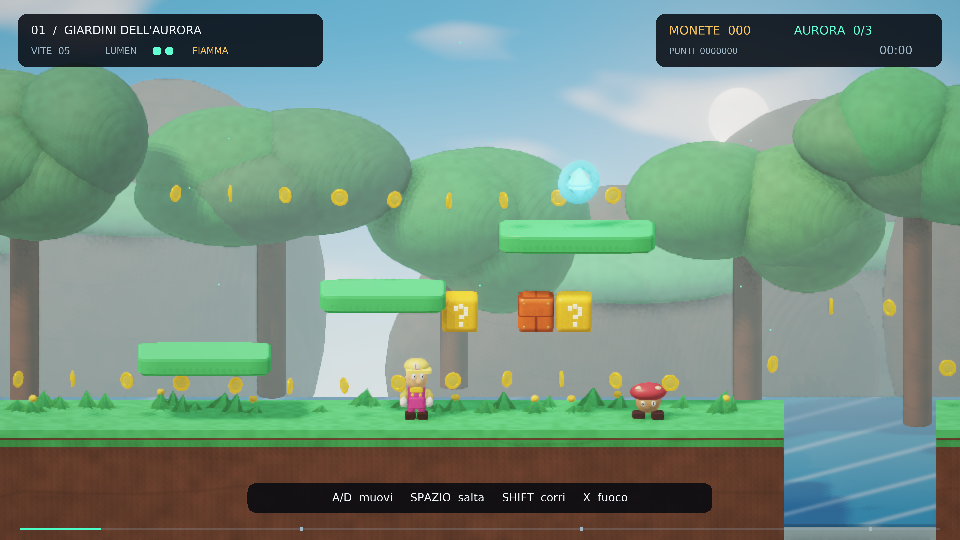

# Super Lumen / Aurora Worlds

Un platform 2.5D in **un singolo file Python**. Cinque mondi, renderer OpenGL
scritto a mano, tutto generato proceduralmente a runtime: mesh, materiali,
shader GLSL, livelli, musica ed effetti sonori. Nessun asset esterno.

> Scritto interamente da un modello linguistico in **una singola risposta**,
> da un solo prompt. Nessuna iterazione, nessuna correzione a mano.



*Il gioco è in italiano.*

---

## Origine

Il codice di questo gioco è stato **generato interamente da un modello
linguistico** (GPT-6 Astra di OpenAI) **in una singola risposta, da un singolo
prompt**: nessuna iterazione, nessun intervento manuale sul codice, nessuna
sessione di debugging. 2.888 righe, 24 classi, 144 funzioni, funzionante al
primo avvio.

Il repository esiste per documentare quel risultato. Non è materiale
promozionale e non è affiliato a OpenAI né a nessun altro fornitore: il
modello è indicato perché senza quell'informazione il repo sarebbe
disonesto, non per pubblicizzarlo.

### Cosa è stato modificato dopo la generazione

Il file generato è conservato **intatto** nella cronologia git, al tag
[`generated-original`](../../tree/generated-original): quello è l'artefatto
one-shot, verificabile riga per riga.

Sul branch `main` il file ha **tre righe di differenza**, puramente estetiche:
la palette del protagonista è stata cambiata e un dettaglio del volto rimosso,
per dare al personaggio un aspetto proprio. Nessuna logica di gioco, nessun
livello, nessuno shader è stato toccato — i 22 test passano identici prima e
dopo. Il diff completo è una riga di `git diff`:

```bash
git diff generated-original main -- super_lumen.py
```

## Cosa c'è dentro

Un file da 131 KB che, senza leggere nulla dal disco, costruisce:

- **Renderer OpenGL 3.3+** via `ctypes`: HDR, illuminazione ispirata a
  Cook-Torrance, shadow map con PCF, ambient occlusion in screen space, luce
  volumetrica campionata dalle ombre, piramide di bloom, cielo procedurale,
  FXAA, tone mapping in stile ACES
- **SDL2 caricato con `ctypes`** — nessun binding Python, nessun `pygame`
- **Audio sintetizzato** a runtime e inviato con `SDL_QueueAudio`
- **Cinque mondi** con temi, nemici e meccaniche proprie
- **22 test di logica di gioco** eseguibili senza aprire una finestra

Pillow serve **solo** a costruire l'atlante dei font. NumPy per la matematica
delle mesh. Nient'altro.

## I cinque mondi

| # | Mondo | |
|---|---|---|
| 1 | **Giardini dell'Aurora** | Tra chiome giganti e sentieri sospesi |
| 2 | **Grotte di Luceluna** | Funghi di luce, rimbalzi e ponti che svaniscono |
| 3 | **Officine del Cielo** | Ingranaggi, ascensori e corrente ascensionale |
| 4 | **Cattedrale di Brina** | Cristalli, ghiaccio vivo e raffiche di neve |
| 5 | **Fortezza dell'Eclisse** | Ponti incandescenti e il guardiano del sole |

Ogni mondo contiene 3 frammenti d'aurora. Il portale finale resta chiuso
finché il boss non è stato battuto.

## Requisiti

- Linux desktop con **OpenGL 3.3+**
- **Python ≥ 3.10**
- NumPy, Pillow, SDL2

Su Ubuntu 24.04:

```bash
sudo apt update
sudo apt install python3-numpy python3-pil libsdl2-2.0-0
```

## Avvio

```bash
python3 super_lumen.py
```

Qualche variante:

```bash
python3 super_lumen.py --fullscreen --quality extreme
python3 super_lumen.py --width 2560 --height 1440 --quality extreme
python3 super_lumen.py --level 3          # vai diretto al mondo 3
python3 super_lumen.py --self-test        # 22 test, nessuna finestra
python3 super_lumen.py --benchmark 30     # tour automatico di 30 secondi
```

Opzioni complete con `--help`: risoluzione, `--quality {high,ultra,extreme}`,
`--scale` per la risoluzione di render interna, `--fps`, `--no-vsync`,
`--mute`, `--no-save`, `--smoke-test`.

### Se non parte

Su Wayland può servire forzare X11:

```bash
SDL_VIDEODRIVER=x11 python3 super_lumen.py
```

Con GPU o driver più modesti:

```bash
python3 super_lumen.py --quality high --scale 1 --width 1280 --height 720
```

## Comandi

| Tasto | Azione |
|---|---|
| `A` / `D` o frecce | Muoviti |
| `Spazio` / `Z` | Salta (tieni premuto per saltare più in alto) |
| `Shift` | Corri |
| `X` / `Ctrl` | Lancia fuoco, quando ne hai il potere |
| `S` / `Giù` in aria | Schiacciata a terra |
| `Esc` / `P` | Pausa |
| `R` | Respawn |
| `M` | Muto |
| `F1` `F2` `F3` | Aiuto, qualità, statistiche |
| `F11` / `F12` | Schermo intero / screenshot |

Sono supportati i controller in stile Xbox tramite SDL2.

Salvataggi, screenshot e report di benchmark finiscono in
`$XDG_DATA_HOME/super_lumen/`, cioè di norma `~/.local/share/super_lumen/`.
`--no-save` disattiva del tutto la scrittura dei progressi.

## Test

```bash
python3 super_lumen.py --self-test
```

Verifica la fisica del salto, il calpestamento dei nemici, il calcio ai gusci,
i blocchi `?` e i mattoni, le piattaforme che si sbriciolano, le molle, le
pedane mobili, l'invulnerabilità dopo un colpo, e che ogni percorso principale
sia effettivamente attraversabile con la distanza di salto disponibile.

Il test grafico ha bisogno di un display:

```bash
python3 super_lumen.py --smoke-test
```

## Originalità dei contenuti

Ogni mesh, texture, traccia audio, livello e shader di questo gioco è
**generato dal codice in questo repository** a ogni avvio. Il progetto non
contiene, non incorpora e non distribuisce asset, codice, audio o dati
appartenenti a terzi: non c'è un solo file di risorse sul disco, perché non
c'è alcun file di risorse.

Nomi, mondi, personaggi e colonna sonora sono originali. Il gioco appartiene
al genere dei platform a scorrimento, le cui meccaniche — correre, saltare,
colpire blocchi, schiacciare nemici — sono idee di gioco non tutelabili in
quanto tali, e sono comuni a decine di titoli indipendenti.

Il progetto non è affiliato, sponsorizzato o approvato da alcun editore di
videogiochi.

## Licenza

MIT — vedi [LICENSE](LICENSE).

La licenza copre il codice di questo repository. Non estende alcun diritto su
proprietà intellettuale di terzi.
